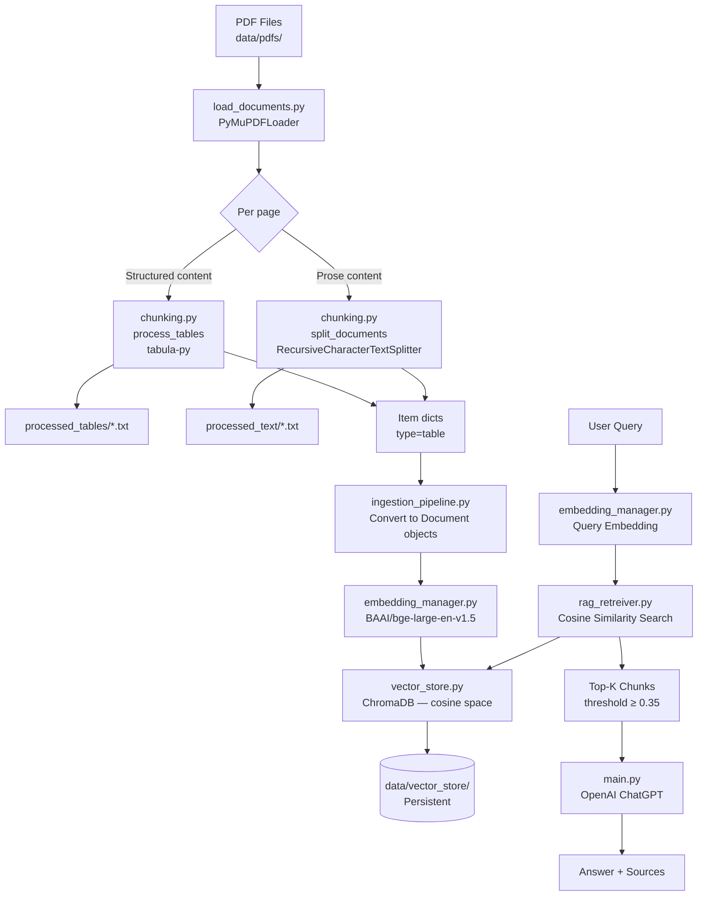
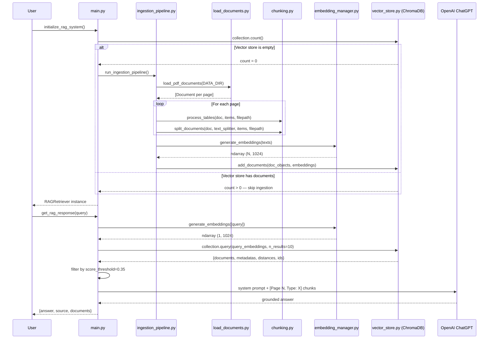
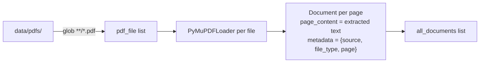
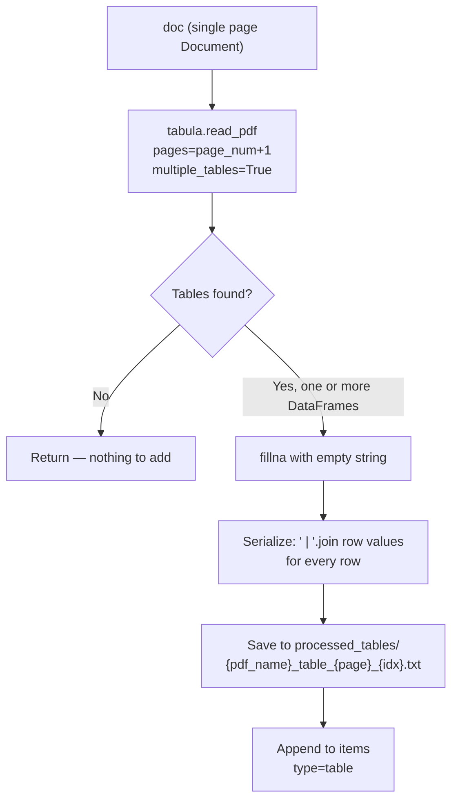
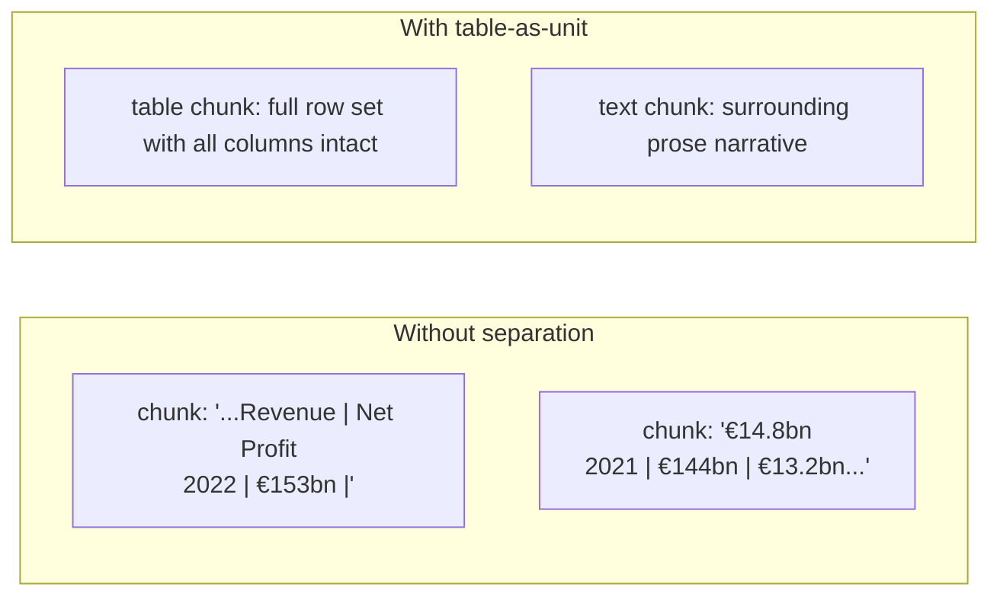
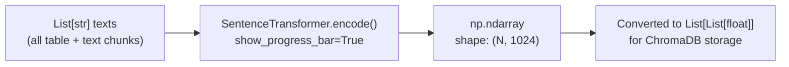
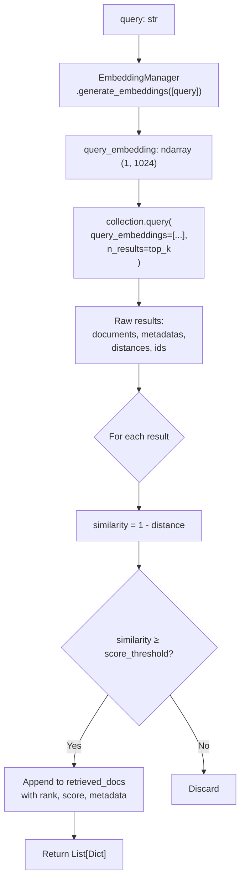
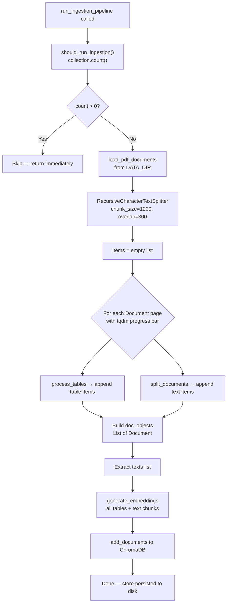
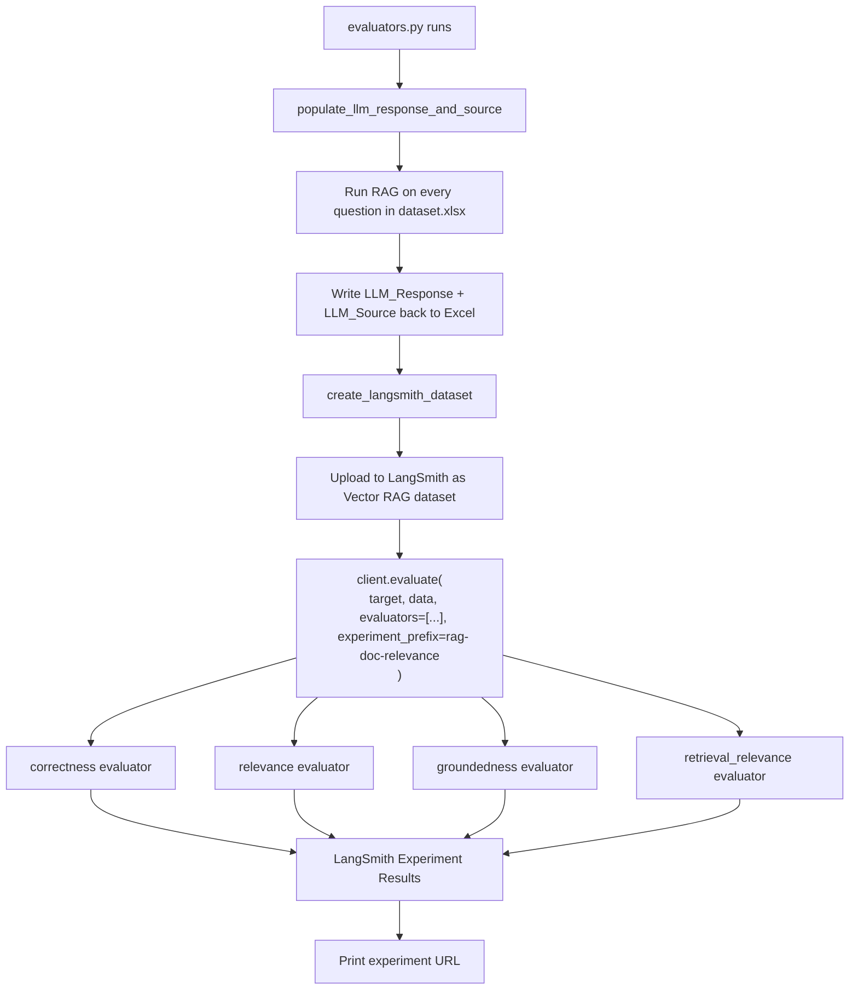
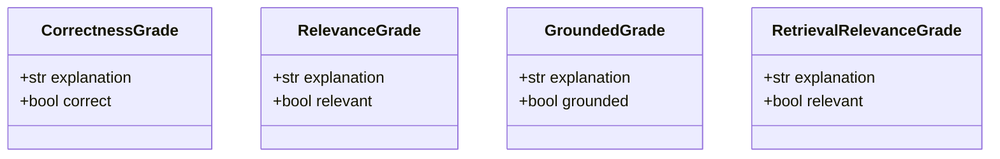

# Technical Documentation

## Table of Contents

- [Technical Documentation](#technical-documentation)
  - [Table of Contents](#table-of-contents)
  - [1. System Overview](#1-system-overview)
  - [2. End-to-End Data Flow](#2-end-to-end-data-flow)
  - [3. Document Loading](#3-document-loading)
  - [4. Content Extraction — Text vs Tables](#4-content-extraction--text-vs-tables)
    - [4.1 Text Chunking](#41-text-chunking)
    - [4.2 Table Extraction](#42-table-extraction)
    - [4.3 Why They Are Handled Separately](#43-why-they-are-handled-separately)
  - [5. Embedding Generation](#5-embedding-generation)
    - [Why BAAI/bge-large-en-v1.5?](#why-baaibge-large-en-v15)
    - [Embedding flow](#embedding-flow)
  - [6. Vector Store \& Cosine Similarity](#6-vector-store--cosine-similarity)
    - [Collection configuration](#collection-configuration)
    - [Cosine similarity explained](#cosine-similarity-explained)
    - [Document storage schema](#document-storage-schema)
  - [7. Retrieval](#7-retrieval)
  - [8. LLM Generation](#8-llm-generation)
    - [Prompt structure](#prompt-structure)
    - [Source extraction](#source-extraction)
    - [LangSmith tracing](#langsmith-tracing)
  - [9. Ingestion Pipeline Orchestration](#9-ingestion-pipeline-orchestration)
  - [10. Evaluation Framework](#10-evaluation-framework)
    - [Dataset](#dataset)
    - [Evaluation pipeline](#evaluation-pipeline)
    - [Evaluators](#evaluators)
  - [11. Configuration Reference](#11-configuration-reference)
    - [config/config.py](#configconfigpy)
    - [Environment variables (.env)](#environment-variables-env)
    - [Tunable parameters (in source)](#tunable-parameters-in-source)

---

## 1. System Overview

This system is a **Retrieval-Augmented Generation (RAG)** pipeline optimised for financial PDF documents. It answers natural-language questions by:

1. Ingesting PDFs once, extracting both prose text and tabular data
2. Embedding every chunk with sentence transformer
3. Storing embeddings in vector database (ChromaDB)
4. At query time, retrieving the most semantically similar chunks
5. Sending those chunks as context to an OpenAI LLM to generate a grounded, cited answer



---

## 2. End-to-End Data Flow



---

## 3. Document Loading

**File:** [src/rag/load_documents.py](src/rag/load_documents.py)

`load_pdf_documents(path)` recursively scans the given directory for `*.pdf` files and loads each one using LangChain's `PyMuPDFLoader` (backed by the `pymupdf` / `fitz` library).



**Key behaviours:**
- Each page of a PDF becomes a separate `Document` object. This is intentional — it preserves page-level provenance so answers can cite exact page numbers.
- `metadata["source"]` is set to just the **filename** (not full path), keeping metadata portable.
- `metadata["file_type"]` is always `"pdf"`.
- Failures on individual files are caught and logged; the pipeline continues with remaining files.

---

## 4. Content Extraction — Text vs Tables

**File:** [src/rag/chunking.py](src/rag/chunking.py)

Financial PDFs contain two fundamentally different content types that require different handling:

| Property | Prose Text | Tables |
|---|---|---|
| Structure | Free-form paragraphs | Grid of rows and columns |
| Embedding strategy | Chunked by sentence/paragraph boundaries | Entire table as one unit |
| Extraction tool | `PyMuPDF` (already done by loader) | `tabula-py` (Java-based PDF table parser) |
| Output format | Plain text | Pipe-delimited rows |
| ChromaDB `type` tag | `"text"` | `"table"` |

### 4.1 Text Chunking

`split_documents(doc, text_splitter, items, filepath)` receives a single page `Document` and splits its text into overlapping chunks using LangChain's `RecursiveCharacterTextSplitter`.

**Splitter configuration (set in `ingestion_pipeline.py`):**

```python
RecursiveCharacterTextSplitter(
    chunk_size=1200,    # target max characters per chunk
    chunk_overlap=300,  # overlap to preserve sentence context across boundaries
    separators=["\n\n", "\n", " ", ""]  # tries to split at paragraph > line > word > char
)
```

**Why these values?**
- 1200 characters ≈ 200–250 tokens, fitting comfortably within the model's context limit while being large enough to carry coherent semantic meaning.
- 300-character overlap ensures that sentences split at a chunk boundary still appear in full in one of the two adjacent chunks, preventing loss of mid-sentence context.
- The separator hierarchy tries to break at natural semantic boundaries first (paragraphs, then lines, then words) before resorting to hard character splits.

Each chunk is saved to `data/processed_data/processed_text/` and appended to `items` as:

```python
{
    "page": int,          # 0-indexed page number
    "type": "text",
    "text": str,          # chunk content
    "path": str,          # path to saved .txt file
    "source": str         # PDF filename
}
```

### 4.2 Table Extraction

`process_tables(doc, items, filepath)` re-opens the same PDF with `tabula-py` targeting only the current page number, extracting all tables as Pandas DataFrames.



**Serialization format:** Each table row becomes a `|`-delimited string. For a DataFrame like:

| Year | Revenue | Net Profit |
|---|---|---|
| 2022 | €153bn | €14.8bn |

The serialized output is:
```
2022 | €153bn | €14.8bn
```

This format is chosen because:
- It is readable by the LLM as structured text
- Column separators make cell boundaries unambiguous
- It keeps the entire table as a single retrievable unit rather than fragmenting rows across chunks

**Error handling:** If `tabula-py` cannot parse a page (e.g. the table is an image, not native PDF text), the exception is caught and logged; the page is skipped for table extraction but still chunked as text.

### 4.3 Why They Are Handled Separately

If tables were chunked the same way as prose, a 1200-character window might split a table mid-row, breaking the relationship between column headers and values. The LLM would then receive incomplete rows with no header context.

By treating each table as an atomic unit, the retriever can return a complete, coherent table to the LLM — which is critical for financial questions like "What was the revenue breakdown by segment in 2022?" where a partial table would produce wrong answers.



---

## 5. Embedding Generation

**File:** [src/rag/embedding_manager.py](src/rag/embedding_manager.py)

`EmbeddingManager` wraps the `sentence-transformers` library, loading the `BAAI/bge-large-en-v1.5` model.

### Why BAAI/bge-large-en-v1.5?

This model is a top performer on the MTEB (Massive Text Embedding Benchmark) leaderboard for English retrieval tasks. Key properties:

| Property | Value |
|---|---|
| Embedding dimension | 1024 |
| Max sequence length | 512 tokens |
| Training objective | Contrastive (bi-encoder) |
| Optimised for | Asymmetric retrieval (short query → long passage) |

The BGE family is specifically trained for retrieval with an **asymmetric setup** — a short user query should return semantically similar longer document passages, which is exactly this system's use case.

### Embedding flow



The model is loaded once in `__init__` via `_load_model()` and reused for both ingestion-time document embeddings and query-time query embeddings. This avoids repeated model loading overhead.

---

## 6. Vector Store & Cosine Similarity

**File:** [src/rag/vector_store.py](src/rag/vector_store.py)

`VectorStore` wraps ChromaDB's `PersistentClient`, which stores all embeddings and metadata to disk at `./data/vector_store/`.

### Collection configuration

```python
self.collection = self.client.get_or_create_collection(
    name="pdf_documents",
    metadata={
        "hnsw:space": "cosine"   # distance metric
    }
)
```

Setting `hnsw:space` to `"cosine"` configures ChromaDB's HNSW (Hierarchical Navigable Small World) index to use **cosine distance** rather than the default Euclidean distance.

### Cosine similarity explained

Given a query vector **q** and a document vector **d**, cosine similarity is:

```
similarity(q, d) = (q · d) / (‖q‖ × ‖d‖)
```

This measures the **angle** between the two vectors, ignoring magnitude. A similarity of 1.0 means the vectors point in exactly the same direction (semantically identical); 0.0 means orthogonal (unrelated); negative values mean opposite.

ChromaDB returns **cosine distance** = `1 − similarity`. The retriever converts this back:

```python
similarity_score = 1 - distance
```

**Why cosine over Euclidean?**  
Embedding magnitudes vary with text length. A short three-word query would have a small magnitude compared to a full paragraph embedding. Euclidean distance would penalise this size mismatch even if the semantic direction is identical. Cosine distance is magnitude-invariant, making it the standard choice for text retrieval.

### Document storage schema

Each entry stored in ChromaDB contains:

| Field | Content |
|---|---|
| `id` | `doc_{8-char UUID}_{index}` |
| `document` | Raw text content |
| `embedding` | `List[float]` of length 1024 |
| `metadata.page` | 0-indexed page number |
| `metadata.type` | `"text"` or `"table"` |
| `metadata.path` | Path to the saved `.txt` file |
| `metadata.source` | PDF filename |
| `metadata.doc_index` | Position in the batch |
| `metadata.content_length` | Character count of the chunk |

---

## 7. Retrieval

**File:** [src/rag/rag_retreiver.py](src/rag/rag_retreiver.py)

`RAGRetriever.retrieve(query, top_k, score_threshold)` implements the full retrieval step.



**Return structure per document:**

```python
{
    "id": str,               # ChromaDB document ID
    "content": str,          # Full chunk text
    "metadata": dict,        # page, type, source, path, content_length
    "similarity_score": float,  # cosine similarity (0.0–1.0)
    "distance": float,       # raw ChromaDB cosine distance
    "rank": int              # 1-indexed position in result set
}
```

**Score threshold (0.35):** Chunks with similarity below this are discarded even if they are in the top-K. This prevents the LLM from receiving irrelevant context that could mislead it. The value 0.35 was chosen empirically for financial document retrieval — it is lenient enough to capture semantically related but not lexically identical passages, while filtering out clearly unrelated chunks.

---

## 8. LLM Generation

**File:** [src/rag/main.py](src/rag/main.py)

`get_rag_response(query, rag_retriever)` assembles the final prompt and calls the OpenAI LLM.

### Prompt structure

```
[System]
You are a financial analyst assistant. Answer questions strictly based on
the provided document excerpts. When a numeric value is requested, reproduce
it exactly as it appears in the documents. If the documents do not contain
enough information to answer, say so explicitly — do not guess or extrapolate.
Cite the page number when available.

[User]
Question: {query}

Document Excerpts:
[Page 42, Type: text]
{chunk_content}

---

[Page 43, Type: table]
{table_content}

---
...

Answer:
```

Each chunk is annotated with its page number and whether it is a `text` or `table` chunk. This lets the LLM distinguish narrative from structured data and produce citations like "according to the table on page 43".

### Source extraction

`get_llm_source(relevant_documents)` collects unique page numbers from the retrieved documents and formats them as a comma-separated string (`"Page 42, Page 43"`). Page numbers are stored 0-indexed internally and displayed as 1-indexed in output.

### LangSmith tracing

`run_retrieval_query()` is decorated with `@traceable()`, which automatically logs inputs, outputs, and token usage to the configured LangSmith project. This enables latency monitoring, token cost analysis, and regression detection over time.

---

## 9. Ingestion Pipeline Orchestration

**File:** [src/rag/ingestion_pipeline.py](src/rag/ingestion_pipeline.py)

`run_ingestion_pipeline(embedding_manager, vector_store)` is the top-level orchestrator. It is designed to be **idempotent** — safe to call on every startup.



**Idempotency:** The guard `should_run_ingestion` checks `collection.count()` before doing any work. This means:
- The full embedding generation (the most expensive step) runs exactly once per vector store lifetime
- Adding new PDFs requires deleting the vector store directory to trigger a fresh ingest

**Processing order:** For each page, tables are extracted **before** text chunking. Both outputs go into the same `items` list and are embedded together in one batch, which is more efficient than two separate encoding passes.

---

## 10. Evaluation Framework

The evaluation system measures four distinct quality dimensions of the RAG pipeline using LLM-as-judge evaluators.

### Dataset

`data/dataset/dataset.xlsx` contains human-curated question-answer pairs:

| Column | Description |
|---|---|
| `Question` | Natural-language query |
| `Reference_Answer` | Ground-truth expected answer |
| `Source` | Expected source page(s) |
| `LLM_Response` | *(written by the pipeline)* Generated answer |
| `LLM_Source` | *(written by the pipeline)* Retrieved source pages |

### Evaluation pipeline



### Evaluators

All four evaluators follow the same pattern: a `ChatOpenAI` model with `with_structured_output()` (JSON schema mode) returns a typed result with an `explanation` field and a boolean grade.



| Evaluator | Inputs | What it checks |
|---|---|---|
| **correctness** | query, reference answer, LLM answer | Is the answer factually accurate vs ground truth? Extra correct information is OK; conflicting statements are not. |
| **relevance** | query, LLM answer | Does the answer actually address the question? Is it concise? |
| **groundedness** | retrieved documents, LLM answer | Does the answer stay within the retrieved facts? Detects hallucination. |
| **retrieval_relevance** | query, retrieved documents | Were the retrieved chunks actually about the question? Measures retrieval quality independently of generation. |

**Structured output (JSON schema mode)** is used instead of plain text so evaluation results can be processed programmatically without fragile string parsing. The `strict=True` flag enforces the exact schema, preventing the grader LLM from adding extra fields.

---

## 11. Configuration Reference

### config/config.py

| Constant | Default | Where used |
|---|---|---|
| `OPENAI_MODEL` | `"gpt-5.4"` | `main.py` (generation), `evaluators.py` (grading) |
| `DATA_DIR` | `"data/pdfs"` | `ingestion_pipeline.py` |
| `DATASET_PATH` | `"data/dataset/dataset.xlsx"` | `evaluation.py` |

### Environment variables (.env)

| Variable | Required | Description |
|---|---|---|
| `OPENAI_API_KEY` | Yes | OpenAI API authentication |
| `LANGSMITH_TRACING` | No | Set `true` to enable LangSmith tracing |
| `LANGSMITH_ENDPOINT` | No | LangSmith API base URL |
| `LANGSMITH_API_KEY` | No | LangSmith authentication key |
| `LANGSMITH_PROJECT` | No | Project name displayed in LangSmith UI |
| `JAVA_HOME` | Yes | Path to JDK installation (required by tabula-py) |

### Tunable parameters (in source)

| Parameter | Location | Default | Effect |
|---|---|---|---|
| `chunk_size` | `ingestion_pipeline.py` | `1200` | Larger = more context per chunk, fewer chunks total |
| `chunk_overlap` | `ingestion_pipeline.py` | `300` | Larger = less risk of losing context at boundaries |
| `top_k` | `main.py` | `10` | More chunks = more context, higher token cost |
| `score_threshold` | `main.py` | `0.35` | Higher = stricter relevance filter |
| `model_name` | `embedding_manager.py` | `BAAI/bge-large-en-v1.5` | Swap for a different sentence transformer |
| `collection_name` | `vector_store.py` | `pdf_documents` | ChromaDB collection identifier |
| `persist_directory` | `vector_store.py` | `./data/vector_store` | Where ChromaDB writes to disk |
